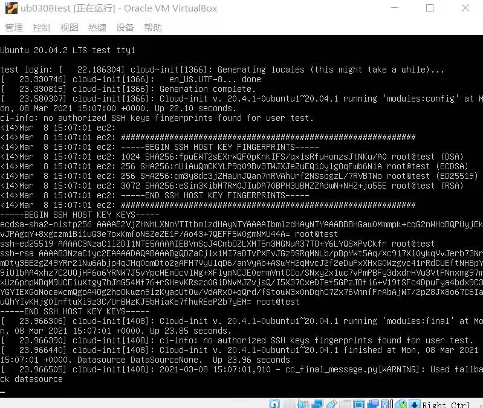

# Linux第一次实验

# 实验报告

### 手动安装部分

当时做的时候甚至一开始都没意识到做的是手动，光是记得有一个选项要选，然后说上课时间不够就没选。我当时就头一铁就选了，居然就是手动了。

附上当时做的时候的截图以及和老师一样光注意那个在转的圈圈没注意到上面高亮的complete之后被嘲笑的记录。现在想想他好像也没嘲笑明白ouo

### 无人值守安装部分

跟着视频一步步做，中间出了一个小小的问题，但是并没影响我把文件拷出来，于是就没管了。

然后就是对照修改!

当时疑惑了好久为什么我的那么短。就算是原始的也不该才30行来着[有那么一瞬间想过难道前面的小error问题大了]，但是去看了下老师传的懒人版之后觉得应该问题不大。

（事实上几乎是对着懒人版和视频改的（事实上也就应该是这么做的（只能说一开始头有点铁

###### and there goes the bad news

我确认了前面的安装并没有出现问题

然后在排查了半天之后，后知后觉地想起来好像是忘了把他们传进去了。总之就，十分想掀桌子。解决+把文件再整出来。

然后按部就班进行下一步。

### Done

#### 参考目录

1.https://github.com/c4pr1c3/LinuxSysAdmin/blob/a3c3ed18cf38b9e4be1ea53b46efe7f02e4ab8b5/chap0x01.exp.md

2.https://ubuntu.com/server/docs/install/autoinstall

3.https://www.cnblogs.com/afeige/p/12144296.html

4.https://www.bilibili.com/video/BV1Hb4y1R7FE?p=28&spm_id_from=pageDriver

5.其他同学的作业仓库

#### 其他问题

工作环境没统一起来，alt和tab都快按烂了，希望下次自己能习惯在单一环境里进行操作，毕竟这个实验的复杂度靠单一环境完全可以应付得来。

