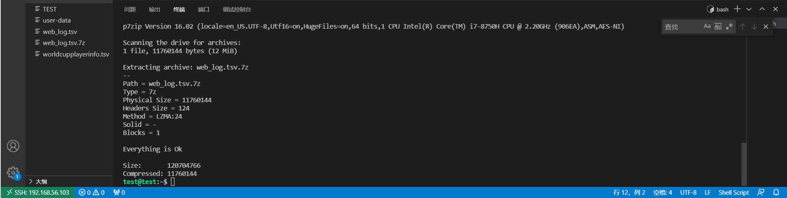

# 实验四：shell脚本编程练习基础
# 一、实验环境
- ubuntu 20.04.2 LTS (挂载共享文件夹)
- Oracle VM VirtualBox version 6.1.18 with Extension Pack installed
- git bash
# 二、编程任务
### 任务一：用bash编写一个图片批处理脚本，实现以下功能：
- ☑️支持命令行参数方式使用不同功能
- ☑️支持对指定目录下所有支持格式的图片文件进行批处理指定目录进行批处理
- ☑️支持以下常见图片批处理功能的单独使用或组合使用
    - ☑️支持对jpeg格式图片进行图片质量压缩
    - ☑️支持对jpeg/png/svg格式图片在保持原始宽高比的前提下压缩分辨率
    - ☑️支持对图片批量添加自定义文本水印
    - ☑️支持批量重命名（统一添加文件名前缀或后缀，不影响原始文件扩展名）
    - ☑️支持将png/svg图片统一转换为jpg格式
### 任务二：用bash编写一个文本批处理脚本，对以下附件分别进行批量处理完成相应的数据统计任务：

- ☑️统计不同年龄区间范围（20岁以下、[20-30]、30岁以上）的球员数量、百分比
- ☑️统计不同场上位置的球员数量、百分比
- ☑️名字最长的球员是谁？名字最短的球员是谁？
- ☑️年龄最大的球员是谁？年龄最小的球员是谁？

### 任务三：用bash编写一个文本批处理脚本，对以下附件分别进行批量处理完成相应的数据统计任务：
- ☑️统计访问来源主机TOP 100和分别对应出现的总次数
- ☑️统计访问来源主机TOP 100 IP和分别对应出现的总次数
- ☑️统计最频繁被访问的URL TOP 100
- ☑️统计不同响应状态码的出现次数和对应百分比
- ☑️分别统计不同4XX状态码对应的TOP 10 URL和对应出现的总次数
- ☑️给定URL输出TOP 100访问来源主机

# 三、实验要求
- 所有源代码文件必须单独提交并提供详细的```-help```脚本内置帮助信息
- 任务三的所有统计数据结果要求写入独立实验报告

### 任务一
- 安装```imagemagick```和```shellcheck```。
```bash
sudo apt-get update 
sudo apt-get install shellcheck
sudo apt-get install imagemagick
```
- 编写脚本 
```shell
function help {
    echo "helpings are as follows"
    echo "-q Q               对jpeg格式图片进行图片质量因子为Q的压缩"
    echo "-r R               对jpeg/png/svg格式图片在保持原始宽高比的前提下压缩成R分辨率"
    echo "-w font_size text  对图片批量添加自定义文本水印"
    echo "-p text            统一添加文件名前缀，不影响原始文件扩展名"
    echo "-s text            统一添加文件名后缀，不影响原始文件扩展名"
    echo "-t                 将png/svg图片统一转换为jpg格式图片"
    echo "-h                 帮助文档"
}
```
​	可是为什么水印始终没法往jpeg格式图片上加呢

​	※上一句的补充 问题解决了，因为我一下把jpg和jpeg想成一个东西了

### 任务二

- 将所需文件下载到本地

  ```bash
  wget "https://c4pr1c3.gitee.io/linuxsysadmin/exp/chap0x04/worldcupplayerinfo.tsv"
  ```

- 编写脚本 
```shell
function help {
    echo "doc"
    echo "-s                 统计不同年龄区间范围（20岁以下、[20-30]、30岁以上）的球员数量、百分比"
    echo "-p                 统计不同场上位置的球员数量、百分比"
    echo "-n                 名字最长的球员是谁？名字最短的球员是谁？"
    echo "-a                 年龄最大的球员是谁？年龄最小的球员是谁？"
    echo "-h                 帮助文档"
}
```
### 任务三
- 安装 p7zip-full
```bash
sudo apt-get install p7zip-full
```
- 将文件下载到本地并解压
```bash
wget "https://c4pr1c3.gitee.io/linuxsysadmin/exp/chap0x04/web_log.tsv.7z"

7z x web_log.tsv.7z
```

​	在进行这一步的时候出现了意料之外的错误

```bash
test@test:~$ wget "https://c4pr1c3.gitee.io/linuxsysadmin/exp/chap0x04/web_log.tsv.7z"
--2021-05-01 07:54:04--  https://c4pr1c3.gitee.io/linuxsysadmin/exp/chap0x04/web_log.tsv.7z
Resolving c4pr1c3.gitee.io (c4pr1c3.gitee.io)... 212.64.62.183
Connecting to c4pr1c3.gitee.io (c4pr1c3.gitee.io)|212.64.62.183|:443... connected.
HTTP request sent, awaiting response... 404 Not Found
2021-05-01 07:54:09 ERROR 404: Not Found.
```

​	还挺奇幻的 所以最终我是自己在[github对应地址](https://github.com/c4pr1c3/LinuxSysAdmin/blob/master/exp/chap0x04/web_log.tsv.7z)把web_log.tsv.7z下载下来丢进去解压的

​	※修正“挺奇幻”这个说法 我发现我用主系统直接连也连不上[gitee对应地址](https://c4pr1c3.gitee.io/linuxsysadmin/exp/chap0x04/web_log.tsv.7z)

- 解压结果展示

  ​	

- 编写脚本 
```shell
function help {
    echo "doc"
    echo "-o      统计访问来源主机TOP 100和分别对应出现的总次数"
    echo "-i      统计访问来源主机TOP 100 IP和分别对应出现的总次数"
    echo "-u      统计最频繁被访问的URL TOP 100"
    echo "-c      统计不同响应状态码的出现次数和对应百分比"
    echo "-f      分别统计不同4XX状态码对应的TOP 10 URL和对应出现的总次数"
    echo "-s URL  给定URL输出TOP 100访问来源主机"
    echo "-h      帮助文档"
}
```
## 四、参考资料
- [[CUCCS](https://github.com/CUCCS)/[linux-2020-LyuLumos]]([linux-2020-LyuLumos/task01.sh at ch0x04 · CUCCS/linux-2020-LyuLumos (github.com)](https://github.com/CUCCS/linux-2020-LyuLumos/blob/ch0x04/ch0x04/code/task01.sh))
- [imagemagick使用指南](https://blog.csdn.net/wangmeitingaa/article/details/88885711)
- [利用ImageMagick给图片加水印 - 简书 (jianshu.com)](https://www.jianshu.com/p/7cff445afb3d)
- [CUCCS/2021-linux-public-NobugFuML: 2021-linux-public-NobugFuML created by GitHub Classroom](https://github.com/CUCCS/2021-linux-public-NobugFuML)